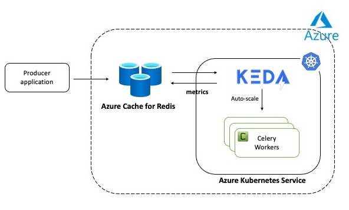

# Autoscale Redis applications on Kubernetes

An application to demonstrate how to automatically scale your Redis-backed Celery workers deployed on Kubernetes. There are multiple ways of achieving this, but we use a Kubernetes-based Event Driven Autoscaler [`KEDA`](https://keda.sh/) to do the heavy lifting, including scaling up the worker fleet based on workload and also scaling it back to zero if there are no tasks in the queue!

The application includes the following components:

- Redis (used as the Celery broker)
- A producer which simulates a client application that submits tasks
- The worker application (running in Kubernetes) which processes the tasks
